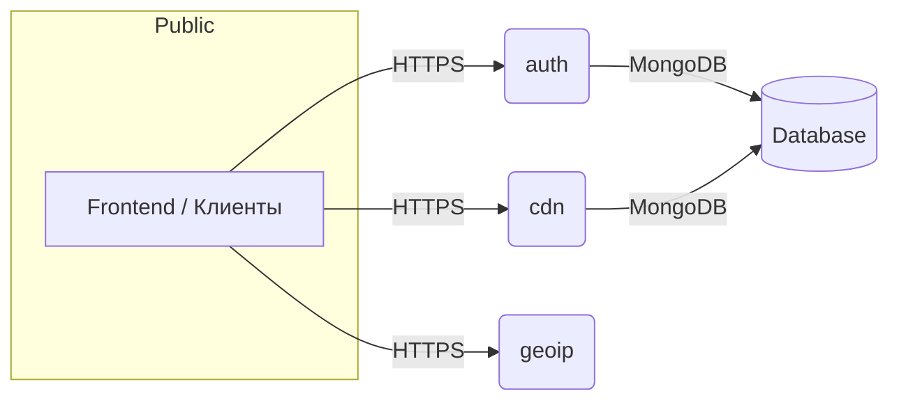

# new‑web‑cores‑archive 🌐📦

[](https://github.com/Shiro-nn/new-web-cores-archive/stargazers)
[](https://github.com/Shiro-nn/new-web-cores-archive/network/members)
[](https://github.com/Shiro-nn/new-web-cores-archive/issues)
[](https://github.com/Shiro-nn/new-web-cores-archive/commits)
[](LICENSE)
[](https://github.com/Shiro-nn/new-web-cores-archive)


> **new‑web‑cores‑archive** — набор микросервисов, который я разрабатывал в 2024‑2025 гг. для одного игрового проекта: аутентификация, CDN‑прокси и GeoIP‑API. В марте 2025 года разработка остановлена, репозиторий переведён в **архивный режим**. Код остаётся в открытом доступе «как есть» — без гарантий поддержки и новых релизов.

---

## 📂 Состав репозитория

| Директория  | Язык/стек                                          | Краткое описание                                                                                                              |
| ----------- | -------------------------------------------------- | ----------------------------------------------------------------------------------------------------------------------------- |
| **`auth`**  | **Rust** (`actix‑web`, `mongodb`, `include‑crypt`) | REST‑API для регистрации/логина, выдаёт JWT, шифрует конфиги прямо в бинарнике.                                               |
| **`cdn`**   | **Rust** (`actix‑web`, `tokio`)                    | Лёгкий обратный прокси и кэш для статики (аналог mini‑CDN): проверка ETag, сжатие brotli/gzip, пассивное кеширование на диск. |
| **`geoip`** | **Node.js** (`express`, `maxmind`)                 | HTTP‑эндпоинт `/geoip?ip=` возвращает ISO‑коды страны/города и координаты по базе MaxMind GeoLite2.                           |

> **Важно:** все три сервиса запускаются **независимо** и не связаны единой оркестрацией — каждый имеет собственный `Cargo.toml` или `package.json`.

---

## 🚀 Быстрый старт (локально)

### auth

```bash
git clone https://github.com/Shiro-nn/new-web-cores-archive.git
cd new-web-cores-archive/auth
cargo run --release            # по умолчанию 0.0.0.0:8080
```

Переменные окружения (`.env`):

```
MONGO_URI=<зашифрованный URI>
JWT_SECRET=<любая_строка>
PORT=8080
```

### cdn

```bash
cd ../cdn
cargo run --release            # стартует на 0.0.0.0:8090
```

Параметры настраиваются через `config.json` (примеры в директории).

### geoip

```bash
cd ../geoip
npm install
node index.js                  # порт 3000
```

Для обновления MaxMind GeoLite2 положите файл `GeoLite2-City.mmdb` в корень `geoip/data`.

---

## 🧩 Мини‑архитектура



* **auth** отвечает за аутентификацию и генерирует JWT, который клиенты передают далее.
* **cdn** прозрачно проксирует статические файлы, проверяя подписи JWT (опционально).
* **geoip** используется внутрисетевыми сервисами для гео‑таргетинга.

---

## 🛠️ Системные требования

* **Rust 1.75+** и `cargo` для `auth` и `cdn`.
* **Node.js 18+** для `geoip`.
* **MongoDB 6+** (если хотите полноценную регистрацию/логирование).

---

## 🤝 Вклад

Репозиторий **архивирован** (март 2025), поэтому PR принимаются только на критические баг‑фиксы или обновления зависимостей. Для развития идей — форкайте и экспериментируйте.

---

## ⚖️ Лицензия

Код распространяется под лицензией **MIT**. Используйте свободно, но без каких‑либо гарантий.

> Спасибо за интерес! Надеюсь, примеры кода окажутся полезными в ваших проектах.
